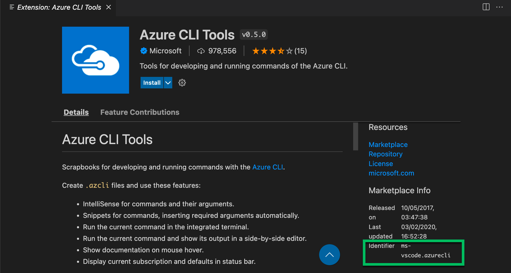

# Extension management on WSL: Ubuntu

## Add extension

To add an extension to VSCode copy extension ID on the extension details page under the Marketplace Info and insert it to `extensions.txt` file.

## Install extensions

Run `install_extensions.sh` script.

## Additional info

__[Command line extension management](https://code.visualstudio.com/docs/editor/extension-marketplace#_command-line-extension-management)__
